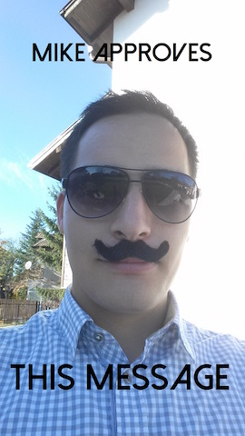

# Amsterdam Patchwork

###Steps to be cool
1. Create a [GitHub](https://github.com) account
2. Fork this repository
3. Add your awesome message
4. Create a pull request
5. See your changes live [here](http://www.amsterdam-patchwork.xyz/)

